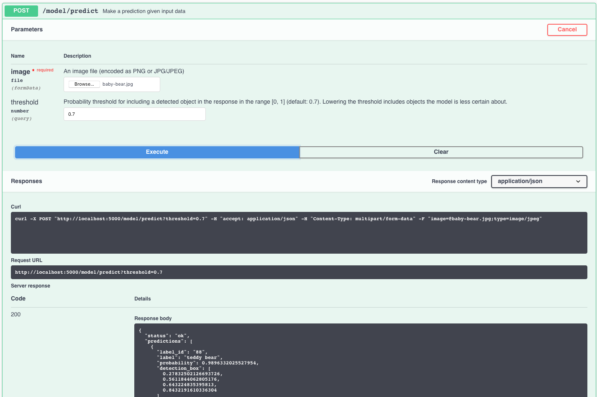

# IBM Code Model Asset Exchange: Object Detector

This repository contains code to instantiate and deploy an object detection model. This model recognizes the objects present in an image from the 80 different high-level classes of objects in the [COCO Dataset](http://mscoco.org/). The model consists of a deep convolutional net base model for image feature extraction, together with additional convolutional layers specialized for the task of object detection, that was trained on the COCO data set. The input to the model is an image, and the output is a list of estimated class probilities for the objects detected in the image.

The model is based on the [SSD Mobilenet V1 object detection model for TensorFlow](https://github.com/tensorflow/models/blob/master/research/object_detection/g3doc/detection_model_zoo.md). The model files are hosted on [IBM Cloud Object Storage](http://max-assets.s3-api.us-geo.objectstorage.softlayer.net/object_detection/ssd_mobilenet_v1_coco_2017_11_17.tar.gz). The code in this repository deploys the model as a web service in a Docker container. This repository was developed as part of the [IBM Code Model Asset Exchange](https://developer.ibm.com/code/exchanges/models/).

## Model Metadata
| Domain | Application | Industry  | Framework | Training Data | Input Data Format |
| ------------- | --------  | -------- | --------- | --------- | -------------- | 
| Vision | Object Detection | General | TensorFlow | [COCO Dataset](http://mscoco.org/) | Image (RGB/HWC) | 

## References

* _J. Huang, V. Rathod, C. Sun, M. Zhu, A. Korattikara, A. Fathi, I. Fischer, Z. Wojna,
Y. Song, S. Guadarrama, K. Murphy_, ["Speed/accuracy trade-offs for modern convolutional object detectors"](https://arxiv.org/abs/1611.10012), CVPR 2017
* _Tsung-Yi Lin, M. Maire, S. Belongie, L. Bourdev, R. Girshick, J. Hays, P. Perona, D. Ramanan, C. Lawrence Zitnick, P. Dollár_, ["Microsoft COCO: Common Objects in Context"](https://arxiv.org/abs/1405.0312), arXiv 2015
* _W. Liu, D. Anguelov, D. Erhan, C. Szegedy, S. Reed, C. Fu, A. C. Berg_, ["SSD: Single Shot MultiBox Detector
"](https://arxiv.org/pdf/1512.02325), CoRR (abs/1512.02325), 2016
* _A.G. Howard, M. Zhu, B. Chen, D. Kalenichenko, W. Wang, T. Weyand, M. Andreetto, H. Adam_, ["MobileNets: Efficient Convolutional Neural Networks for Mobile Vision Applications"](https://arxiv.org/abs/1704.04861), arXiv 2017
* [TensorFlow Object Detection GitHub Repo](https://github.com/tensorflow/models/tree/master/research/object_detection)

## Licenses

| Component | License | Link  |
| ------------- | --------  | -------- |
| This repository | [Apache 2.0](https://www.apache.org/licenses/LICENSE-2.0) | [LICENSE](LICENSE) |
| Model Weights | [Apache 2.0](https://www.apache.org/licenses/LICENSE-2.0) | [TensorFlow Models Repo](https://github.com/tensorflow/models/blob/master/LICENSE) |
| Model Code (3rd party) |  [Apache 2.0](https://www.apache.org/licenses/LICENSE-2.0) | [TensorFlow Models Repo](https://github.com/tensorflow/models/blob/master/LICENSE) |
| Test assets | Various | [Asset README](assets/README.md) |

## Pre-requisites:

* `docker`: The [Docker](https://www.docker.com/) command-line interface. Follow the [installation instructions](https://docs.docker.com/install/) for your system.
* The minimum recommended resources for this model is 2GB Memory and 2 CPUs.

## Steps

1. [Build the Model](#1-build-the-model)
2. [Deploy the Model](#2-deploy-the-model)
3. [Use the Model](#3-use-the-model)
4. [Development](#4-development)
5. [Clean Up](#5-clean-up)


## 1. Build the Model

Clone the `MAX-Object-Detection` repository locally. In a terminal, run the following command:

```
$ git clone https://github.ibm.com/IBM/MAX-Object-Detection
```

Change directory into the repository base folder:

```
$ cd MAX-Object-Detection
```

To build the docker image locally, run: 

```
$ docker build -t max-tf-object-detection .
```

All required model assets will be downloaded during the build process. _Note_ that currently this docker image is CPU only (we will add support for GPU images later).


## 2. Deploy the Model

To run the docker image, which automatically starts the model serving API, run:

```
$ docker run -it -p 5000:5000 max-tf-object-detection
```

## 3. Use the Model

The API server automatically generates an interactive Swagger documentation page. Go to `http://localhost:5000` to load it. From there you can explore the API and also create test requests.

Use the `model/predict` endpoint to load a test image (you can use one of the test images from the `assets` folder) and get predicted labels for the image from the API.



You can also test it on the command line, for example:

```
$ curl -F "image=@assets/dog-human.jpg" -XPOST http://127.0.0.1:5000/model/predict
```

You should see a JSON response like that below:

```json
{
  "status": "ok",
  "predictions": [
    {
      "label_id": "1",
      "label": "person",
      "probability": 0.94403499364853
    },
    {
      "label_id": "18",
      "label": "dog",
      "probability": 0.86455118656158
    }
  ]
}
```

## 4. Development

To run the Flask API app in debug mode, edit `config.py` to set `DEBUG = True` under the application settings. You will then need to rebuild the docker image (see [step 1](#1-build-the-model)).

